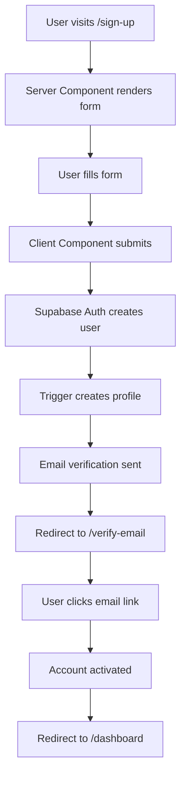
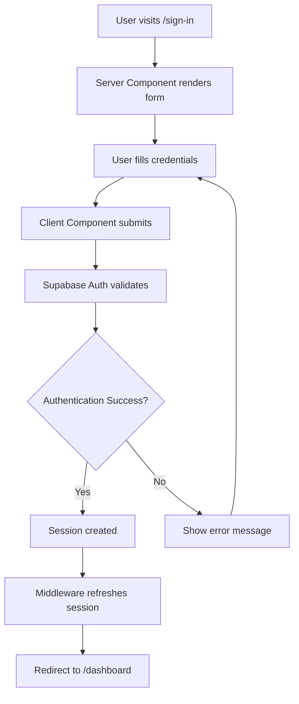
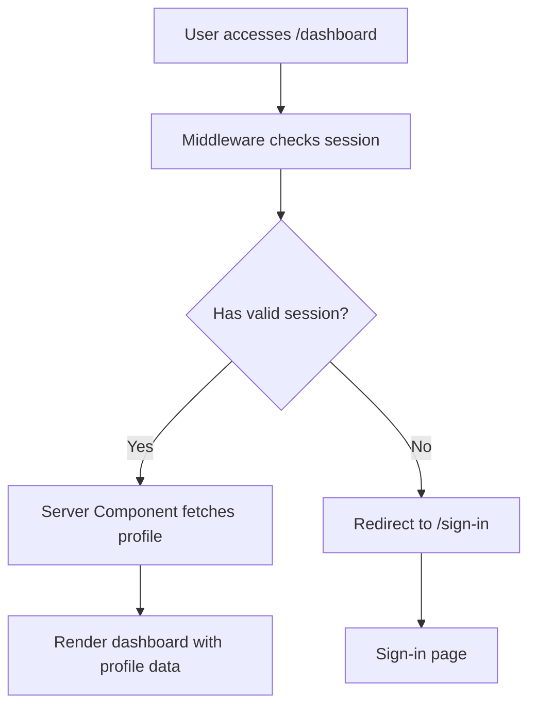
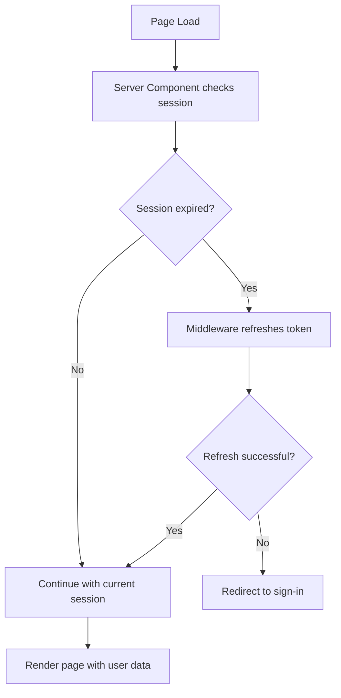

# Authentication Workflow Documentation

## Overview

This document outlines the complete authentication workflow for our Next.js 15 + Supabase SSR application. The authentication system prioritizes server-side rendering, automatic profile creation, and seamless user experience.

## Architecture

### Server-Side Rendering (SSR) Flow
- **Server Components**: Handle authentication checks and data fetching
- **Middleware**: Manages session validation and route protection
- **Client Components**: Handle user interactions and form submissions
- **Cache Busting**: Ensures authenticated content is never cached

## Authentication Flow Diagram

```
┌─────────────────┐    ┌─────────────────┐    ┌─────────────────┐
│   User Access   │───▶│   Middleware    │───▶│  Route Handler  │
│   Protected     │    │   Checks        │    │   (Server)      │
│   Route         │    │   Session       │    │                 │
└─────────────────┘    └─────────────────┘    └─────────────────┘
                                │                        │
                                ▼                        ▼
                       ┌─────────────────┐    ┌─────────────────┐
                       │   Redirect to   │    │   Render Page   │
                       │   Sign-in       │    │   with Profile  │
                       │   (No Session)  │    │   (Has Session) │
                       └─────────────────┘    └─────────────────┘
```

## Database Schema

### Users Table (Supabase Auth)
```sql
-- Automatically managed by Supabase Auth
-- Contains: id, email, email_confirmed_at, created_at, updated_at, etc.
```

### Profiles Table
```sql
-- profiles table with auto-population trigger
CREATE TABLE profiles (
  id uuid REFERENCES auth.users(id) ON DELETE CASCADE,
  username text UNIQUE,
  full_name text,
  avatar_url text,
  bio text,
  website text,
  location text,
  date_of_birth date,
  phone text,
  is_public boolean DEFAULT true,
  created_at timestamp with time zone DEFAULT timezone('utc'::text, now()) NOT NULL,
  updated_at timestamp with time zone DEFAULT timezone('utc'::text, now()) NOT NULL,
  PRIMARY KEY (id)
);

-- Enable Row Level Security
ALTER TABLE profiles ENABLE ROW LEVEL SECURITY;

-- RLS Policies
CREATE POLICY "Users can view own profile" ON profiles
  FOR SELECT USING (auth.uid() = id);

CREATE POLICY "Users can view public profiles" ON profiles
  FOR SELECT USING (is_public = true);

CREATE POLICY "Users can update own profile" ON profiles
  FOR UPDATE USING (auth.uid() = id);

CREATE POLICY "Users can insert own profile" ON profiles
  FOR INSERT WITH CHECK (auth.uid() = id);

-- Indexes for performance
CREATE INDEX idx_profiles_username ON profiles(username);
CREATE INDEX idx_profiles_created_at ON profiles(created_at);
CREATE INDEX idx_profiles_is_public ON profiles(is_public);
```

### Auto-Population Trigger
```sql
-- Function to handle new user profile creation
CREATE OR REPLACE FUNCTION public.handle_new_user()
RETURNS trigger AS $$
BEGIN
  INSERT INTO public.profiles (id, username, full_name)
  VALUES (
    NEW.id,
    COALESCE(NEW.raw_user_meta_data->>'username', split_part(NEW.email, '@', 1)),
    COALESCE(NEW.raw_user_meta_data->>'full_name', NEW.raw_user_meta_data->>'name', split_part(NEW.email, '@', 1))
  );
  RETURN NEW;
END;
$$ LANGUAGE plpgsql SECURITY DEFINER;

-- Trigger to automatically create profile on user signup
CREATE OR REPLACE TRIGGER on_auth_user_created
  AFTER INSERT ON auth.users
  FOR EACH ROW EXECUTE FUNCTION public.handle_new_user();
```

## Authentication Workflows

### 1. Sign-Up Workflow



#### Implementation Details

**Server Component** (`app/(auth)/sign-up/page.tsx`):
```typescript
// Server-side rendering with cache busting
export const dynamic = 'force-dynamic'
export const revalidate = 0

export default async function SignUpPage() {
  const supabase = await createClient()
  const { data: { session } } = await supabase.auth.getSession()
  
  // Redirect authenticated users
  if (session) {
    redirect('/dashboard')
  }

  return (
    <div className="min-h-screen flex items-center justify-center">
      <SignUpForm />
    </div>
  )
}
```

**Client Component** (`components/auth/SignUpForm.tsx`):
```typescript
'use client'

export function SignUpForm() {
  const [isLoading, setIsLoading] = useState(false)
  const [error, setError] = useState('')
  const supabase = createClient()
  const router = useRouter()

  const handleSignUp = async (formData: SignUpFormData) => {
    setIsLoading(true)
    setError('')

    const { error } = await supabase.auth.signUp({
      email: formData.email,
      password: formData.password,
      options: {
        data: {
          full_name: formData.fullName,
          username: formData.username
        }
      }
    })

    if (error) {
      setError(error.message)
    } else {
      router.push('/verify-email')
    }

    setIsLoading(false)
  }

  return (
    <Card className="w-full max-w-md">
      <CardHeader>
        <CardTitle>Create Account</CardTitle>
        <CardDescription>Sign up for a new account</CardDescription>
      </CardHeader>
      <CardContent>
        <SignUpFormComponent onSubmit={handleSignUp} isLoading={isLoading} error={error} />
      </CardContent>
    </Card>
  )
}
```

### 2. Sign-In Workflow



### 3. Protected Route Workflow



### 4. Session Management Workflow



## Component Architecture

### Server Components (Default)
- **Pages**: All auth pages (`/sign-in`, `/sign-up`, `/dashboard`)
- **Layouts**: Root layout and dashboard layout
- **Data Fetching**: Profile loading and user data
- **Route Protection**: Session validation

### Client Components (When Needed)
- **Forms**: Sign-in, sign-up, profile edit forms
- **Interactive Elements**: Buttons with state, form validation
- **Auth Context**: User state management across components

### Component Organization
```
src/
├── app/
│   ├── (auth)/
│   │   ├── sign-in/
│   │   │   ├── page.tsx (Server)
│   │   │   └── loading.tsx (Skeleton)
│   │   ├── sign-up/
│   │   │   ├── page.tsx (Server)
│   │   │   └── loading.tsx (Skeleton)
│   │   └── verify-email/
│   │       ├── page.tsx (Server)
│   │       └── loading.tsx (Skeleton)
│   └── (dashboard)/
│       ├── dashboard/
│       │   ├── page.tsx (Server)
│       │   └── loading.tsx (Skeleton)
│       └── layout.tsx (Server)
├── components/
│   ├── auth/
│   │   ├── index.ts (Barrel export)
│   │   ├── SignInForm.tsx (Client)
│   │   ├── SignUpForm.tsx (Client)
│   │   ├── AuthProvider.tsx (Client)
│   │   └── AuthSkeleton.tsx (Server)
│   └── profile/
│       ├── index.ts (Barrel export)
│       ├── ProfileCard.tsx (Server)
│       ├── ProfileForm.tsx (Client)
│       └── ProfileSkeleton.tsx (Server)
```

## Middleware Configuration

### Route Protection
```typescript
// middleware.ts
import { createServerClient } from '@supabase/ssr'
import { NextResponse, type NextRequest } from 'next/server'

export async function middleware(request: NextRequest) {
  let response = NextResponse.next({
    request: {
      headers: request.headers,
    },
  })

  const supabase = createServerClient(
    process.env.NEXT_PUBLIC_SUPABASE_URL!,
    process.env.NEXT_PUBLIC_SUPABASE_ANON_KEY!,
    {
      cookies: {
        getAll() {
          return request.cookies.getAll()
        },
        setAll(cookiesToSet) {
          cookiesToSet.forEach(({ name, value, options }) => {
            request.cookies.set(name, value)
            response.cookies.set(name, value, options)
          })
        },
      },
    }
  )

  // Refresh session if expired
  const { data: { session } } = await supabase.auth.getSession()

  // Route protection logic
  const protectedRoutes = ['/dashboard', '/profile', '/settings']
  const authRoutes = ['/sign-in', '/sign-up', '/verify-email']
  const publicRoutes = ['/', '/about', '/contact']

  const isProtectedRoute = protectedRoutes.some(route => 
    request.nextUrl.pathname.startsWith(route)
  )
  const isAuthRoute = authRoutes.some(route => 
    request.nextUrl.pathname.startsWith(route)
  )

  // Redirect logic
  if (isProtectedRoute && !session) {
    const url = request.nextUrl.clone()
    url.pathname = '/sign-in'
    url.searchParams.set('redirect', request.nextUrl.pathname)
    return NextResponse.redirect(url)
  }

  if (isAuthRoute && session) {
    const url = request.nextUrl.clone()
    url.pathname = '/dashboard'
    return NextResponse.redirect(url)
  }

  // Cache busting for authenticated pages
  if (isProtectedRoute || (session && !isAuthRoute)) {
    response.headers.set('Cache-Control', 'no-store, no-cache, must-revalidate, proxy-revalidate')
    response.headers.set('Pragma', 'no-cache')
    response.headers.set('Expires', '0')
  }

  return response
}

export const config = {
  matcher: [
    '/((?!_next/static|_next/image|favicon.ico|.*\\.(?:svg|png|jpg|jpeg|gif|webp)$).*)',
  ],
}
```

## Error Handling

### Authentication Errors
```typescript
// Common authentication errors and handling
const authErrors = {
  'Invalid login credentials': 'Invalid email or password',
  'Email not confirmed': 'Please check your email and click the confirmation link',
  'Password should be at least 6 characters': 'Password must be at least 6 characters long',
  'User already registered': 'An account with this email already exists',
  'Email rate limit exceeded': 'Too many attempts. Please try again later'
}

export function getAuthErrorMessage(error: AuthError): string {
  return authErrors[error.message] || 'An unexpected error occurred'
}
```

### Loading States
```typescript
// Loading skeletons for auth components
export function AuthSkeleton() {
  return (
    <Card className="w-full max-w-md">
      <CardHeader>
        <Skeleton className="h-6 w-32" />
        <Skeleton className="h-4 w-48" />
      </CardHeader>
      <CardContent className="space-y-4">
        <Skeleton className="h-10 w-full" />
        <Skeleton className="h-10 w-full" />
        <Skeleton className="h-10 w-full" />
      </CardContent>
    </Card>
  )
}
```

## Security Considerations

### Row Level Security (RLS)
- All profile data protected by RLS policies
- Users can only access their own data
- Public profiles viewable by all users
- Admin roles for special permissions

### Session Security
- Automatic session refresh via middleware
- Secure cookie handling
- CSRF protection via Supabase
- Rate limiting on auth endpoints

### Data Validation
- Client-side form validation with Zod
- Server-side validation in API routes
- Sanitization of user inputs
- Email verification required

## Testing Strategy

### Unit Tests
```typescript
// Example: Auth form validation tests
describe('SignUpForm', () => {
  it('validates email format', () => {
    // Test email validation
  })
  
  it('validates password strength', () => {
    // Test password requirements
  })
  
  it('handles authentication errors', () => {
    // Test error handling
  })
})
```

### Integration Tests
- Test complete sign-up flow
- Test profile creation trigger
- Test session management
- Test route protection

## Performance Optimization

### Code Splitting
- Dynamic imports for auth forms
- Separate bundles for auth vs dashboard
- Lazy loading of profile components

### Caching Strategy
- No caching for authenticated pages
- Static caching for public pages
- CDN caching for assets

### Bundle Analysis
```bash
# Monitor auth bundle sizes
npm run analyze
```

## Deployment Checklist

### Environment Variables
```env
NEXT_PUBLIC_SUPABASE_URL=your_supabase_url
NEXT_PUBLIC_SUPABASE_ANON_KEY=your_supabase_anon_key
SUPABASE_SERVICE_ROLE_KEY=your_service_role_key
```

### Database Setup
- [ ] Create profiles table
- [ ] Set up RLS policies
- [ ] Create auto-population trigger
- [ ] Test trigger functionality
- [ ] Set up proper indexes

### Application Setup
- [ ] Configure Supabase project
- [ ] Set up email templates
- [ ] Configure redirect URLs
- [ ] Test authentication flow
- [ ] Verify session management

---

This authentication workflow provides a comprehensive, secure, and performant authentication system using Supabase SSR with automatic profile creation and proper session management.
